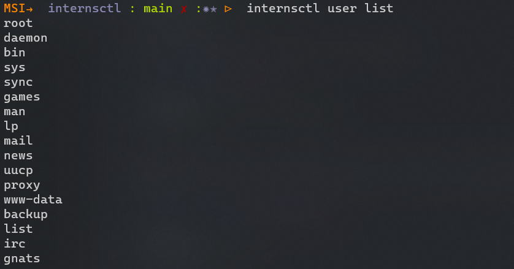

# internsctl

There is a customer who came to you with a problem to have a custom linux
command for his operations. Your task is to understand the problem and create a linux
command via bash script as per the instructions.

- Command name - internsctl
- Command version - v0.1.0

## Usage

First step is to add alias to .rc file of shell

```Bash
$ vim ~/.zshrc
```


```Bash
$ internsctl cpu getinfo
```

Expected Output -
similar output as we get from lscpu command


```Bash
$ internsctl memory getinfo
```

Expected Output
I want similar output as we get from free command


```Bash
$ internsctl user create <username>

```

Note - above command should create user who can login to linux system and access his home
directory
I want to list all the regular users present on my server through the following command:



```Bash
$ internsctl user list

```

If want to list all the users with sudo permissions on my server through the following command:


```Bash
$ internsctl user list --sudo-only

```

By executing below command I want to get some information about a file


```Bash
$ internsctl file getinfo <file-name>

```

Expected Output [make sure to have the output in following format only]
xenonstack@xsd-034:~$ internsctl file getinfo hello.txt
File: hellot.txt
Access: -rw-r--r--
Size(B): 5448
Owner: xenonstack


```Bash
$ internsctl file getinfo [options] <file-name>

```

--size, -s to print size
--permissions, -p print file permissions
--owner, o print file owner
--last-modified, m
